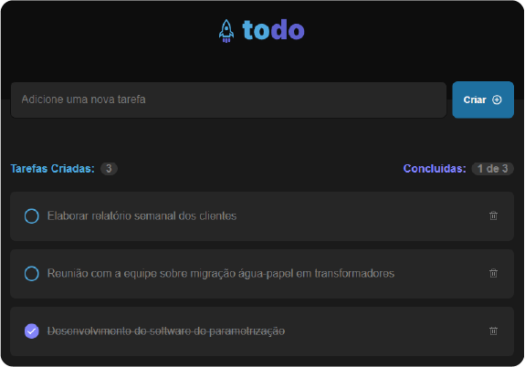

<h1 align="center">
  
</h1>

A simple frontend app for task management.</br>
This application was built as a challenge in Ignite course @ <a href="https://github.com/Rocketseat">rocketseat</a>.

# 

<div align="center">
  
</div>


</br>
<ul>


</ul>

#

### Installing

1. Clone the repo
   ```sh
   git clone https://github.com/hugo-wemer/toDo.git
   ```
2. Install NPM packages
   ```sh
   npm install
   ```
3. Run as developer
   ```sh
   npm run dev
   ```
 #
 ### Predetermined
- [x] Include task <br/>
- [x] Remove task <br/>
- [x]  Mark as complete <br/>
- [x] Count total of tasks and completed tasks <br/>
- [x] Don't allow tasks without description <br/>
 
